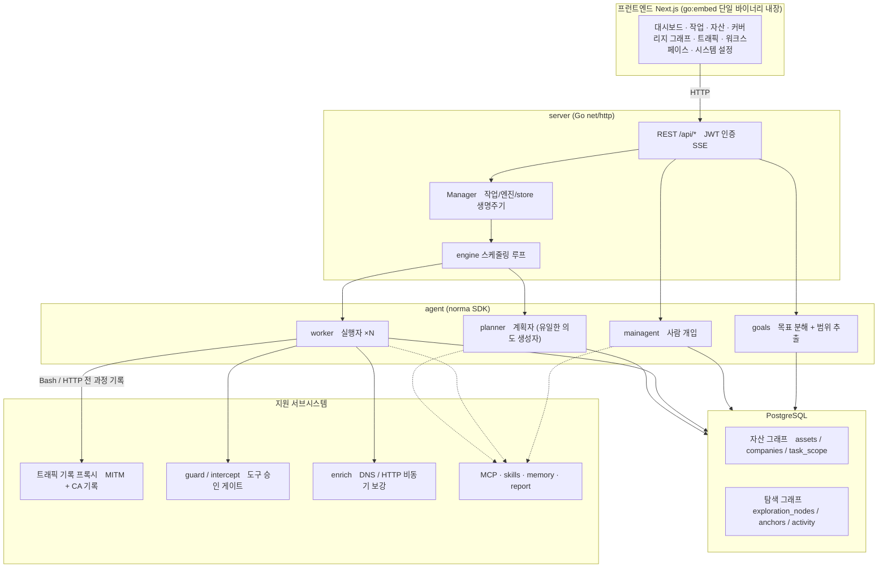
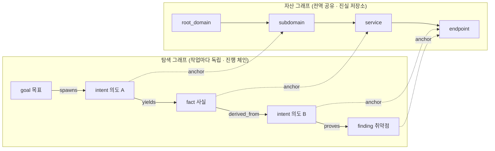
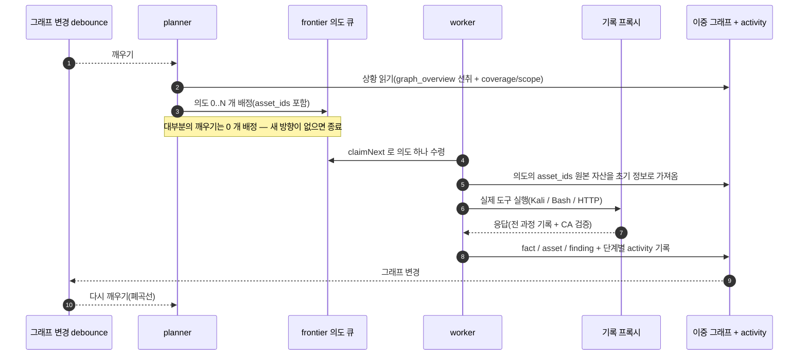

<div align="center">

# ARTEX 한국어판

**LLM 멀티 에이전트가 자율적으로 침투 테스트를 수행하는 시스템** (Go 백엔드 + Next.js 프런트엔드)

한국어 · [中文](README.zh.md) · [English](README.en.md)

</div>

---

> **이 저장소는 중국산 오픈소스 프로젝트 [Autumn-27/ARTEX](https://github.com/Autumn-27/ARTEX)(AGPL-3.0)를 한국 사용자와 팀이 그대로 쓸 수 있도록 현지화한 판본입니다.** 에이전트의 판단 성능을 보존하기 위해 내부 추론 프롬프트는 원문을 유지하고, 사용자에게 보이는 산출물(탐지 결과·요약·리포트·대화 응답)만 한국어로 강제합니다. 아래 "왜 한국어판인가"에서 방침을 설명합니다.

ARTEX 는 LLM 이 조종하는 여러 에이전트가 **스스로 목표를 쪼개고, 실제 도구를 실행하고, 발견한 자산과 취약점을 그래프에 쌓아 가며** 침투 테스트 과정을 자율적으로 끌고 가는 시스템입니다. Go 단일 바이너리 하나에 Next.js 프런트엔드가 내장되어 있고, 데이터는 PostgreSQL 에 저장됩니다.

---

## ⚠️ 먼저 읽어 주세요 — 사용 범위와 국내법 고지

ARTEX 는 **자신이 소유하거나 서면으로 명시적 허가를 받은 대상에 대해서만** 사용할 수 있습니다. 허가 범위를 벗어난 스캐닝·탐지·익스플로잇은 그 자체로 불법이 될 수 있습니다.

- 대한민국에서 권한 없이 타인의 정보통신망에 침입하거나 장애를 일으키는 행위는 **「정보통신망 이용촉진 및 정보보호 등에 관한 법률」** 위반입니다.
- 침투 테스트 과정에서 수집·노출되는 개인정보는 **「개인정보 보호법」** 의 적용을 받습니다. 권한이 있더라도 개인정보 열람·보관·파기를 신중히 다뤄야 합니다.
- **학습·연구·로컬 격리 환경 검증** 목적으로 쓰십시오. 운영 중인 외부 시스템을 대상으로 삼기 전에는 반드시 서면 허가와 범위·시간창 합의를 확보해야 합니다.

자세한 라이선스·사용 제한·면책은 아래 [라이선스와 면책](#라이선스와-면책) 절에 있습니다. 이 도구를 사용하는 것만으로 사용자는 그 조건에 동의한 것으로 봅니다.

---

## 왜 한국어판인가

원본 ARTEX 는 프롬프트·UI·문서가 모두 중국어로 되어 있어, 국내 사용자가 결과를 읽고 팀과 공유하기가 번거로웠습니다. 이 한국어판은 다음을 목표로 합니다.

- **산출물의 한국어화** — 에이전트가 사람에게 내보내는 탐지 결과·사실 요약·최종 리포트·대화 응답을 한국어로 출력하도록 강제합니다. 명령·페이로드·코드·URL·로그 원문은 분석에 필요하므로 원본 그대로 둡니다.
- **성능 보존** — 에이전트의 판단을 좌우하는 내부 추론 프롬프트(행동 지침 본문)는 번역하지 않습니다. 원문으로 벤치마크된 동작을 유지하고, 출력 언어만 바꿔 번역에서 오는 품질 저하를 피합니다.
- **국내법 고지** — 정보통신망법·개인정보보호법 고지와 "권한 범위 안에서만 사용" 경고를 한국어로 분명히 제공합니다.
- **국내 스택 대응** — LLM 공급자를 프런티어 모델뿐 아니라 OpenAI 호환 엔드포인트(국산·오픈 모델)로 교체할 수 있습니다. 아래 [설정](#설정)을 참고하십시오.

> 현지화의 경계와 설계 방침은 저장소의 작업 문서에 더 자세히 적혀 있습니다. 상류(upstream) 저장소의 변경을 대조하기 쉽도록 원본 중국어 문서는 `README.zh.md` 로 보존합니다.

---

## 화면 미리 보기

<!--
  스크린샷은 UI 한국어화(next-intl 적용) 작업이 끝난 뒤 한국어 화면으로 교체합니다.
  원본(중국어 UI) 화면은 README.zh.md 의 "截图预览" 절에서 볼 수 있습니다.
  교체 대상 파일: screenshots/dashboard.png · tasks.png · sessions.png · graph.png ·
                  findings.png · assets.png · assets_test.png · traffic.png · chat.png ·
                  agents.png · llm.png · intercept.png · logs.png
-->

UI 한국어화가 끝나는 대로 한국어 화면(대시보드·작업 목록·탐색 그래프·자산 커버리지·탐지 결과·사람 개입 대화)을 이 자리에 넣습니다. 그때까지는 원본 화면을 [`README.zh.md`](README.zh.md#截图预览)에서 확인할 수 있습니다.

---

## 빠른 시작 (Docker Compose)

> **사전 요구:** Docker 와 Docker Compose. 데이터베이스는 **PostgreSQL** 이며 compose 가 함께 띄웁니다. 탐색에는 **LLM** 이 필요합니다(`ANTHROPIC_API_KEY` 또는 `OPENAI_API_KEY`, UI 에서도 설정 가능).

```bash
git clone https://github.com/jiwoochris/artex-ko.git
cd artex-ko
cp .env.example .env          # POSTGRES_PASSWORD 설정, ANTHROPIC_API_KEY 는 선택
docker compose up -d          # artex 이미지 + postgres 를 함께 기동
# → http://localhost:8787 접속 (처음 들어가면 /setup 에서 관리자 비밀번호 설정)
```

이미지에는 자주 쓰는 도구(ripgrep·curl·vim·npm·nmap 등)가 들어 있습니다. `./skills` 와 `./data` 는 바인드 마운트로 호스트에 남아 컨테이너를 다시 만들어도 보존됩니다.

### 그 밖의 설치 방법

원본 저장소는 설치 스크립트(`./install.sh`), 사전 컴파일 바이너리(Releases), 소스 단일 바이너리 컴파일 등 여러 방법을 제공합니다. 명령과 절차는 [`README.zh.md`](README.zh.md#安装)의 "安装"(설치) 절에 정리되어 있으며, 아래 핵심만 옮깁니다.

- **설치 스크립트:** `./install.sh` 를 실행하면 Docker 감지·설치 후 "① 전부 Docker" 또는 "② 로컬 컴파일 실행"을 고르게 합니다.
- **소스에서 단일 바이너리 컴파일:**

  ```bash
  cd web && npm ci && npm run build:static && cd ..   # 1) 프런트엔드 정적 빌드
  cp -r web/out server/webui/dist                     # 2) 내장 디렉터리로 복사
  CGO_ENABLED=0 go build -tags embedui -o artex ./cmd/artex   # 3) 프런트 내장 컴파일
  ./start.sh                                          # → http://localhost:8787
  ```

> 실행은 `./artex` 를 직접 돌리지 말고 `start.sh`(Windows 는 `start.bat`)로 하십시오. 이 스크립트는 종료 코드에 따라 프로그램을 다시 띄우는 감시자이고, UI 의 "원클릭 업데이트"도 이 스크립트가 처리합니다.

---

## 설정

**데이터베이스**(`config.json`, 또는 환경 변수 `ARTEX_PG_DSN` 로 덮어쓰기):

```json
{
  "database": {
    "host": "127.0.0.1", "port": 5432,
    "user": "artex", "password": "yourpass",
    "dbname": "artex", "sslmode": "disable"
  }
}
```

**LLM:** `export ANTHROPIC_API_KEY=sk-...`(또는 `OPENAI_API_KEY`), 혹은 UI 의 "LLM 설정" 페이지에서 입력합니다. 선택 환경 변수로 `ARTEX_LLM_PROVIDER` / `ARTEX_LLM_MODEL` / `ARTEX_LLM_BASE_URL` / `ARTEX_LLM_PROXY` 를 둘 수 있습니다. 국산·오픈 모델을 쓰려면 OpenAI 호환 `ARTEX_LLM_BASE_URL` 을 지정하십시오.

**동시성:** 작업마다 돌리는 worker 에이전트 수는 "시스템 설정"에서 조정합니다(기본값 3).

**자주 쓰는 인자:** `./start.sh -addr :8787 -proxy :8788` — `-addr` 는 프런트엔드와 API, `-proxy` 는 트래픽 기록 프록시 포트입니다.

### 모델 선택과 출력 언어

산출물의 한국어화는 하드 코딩된 상한이 아니라 **프롬프트 지시(`agent/prompt.go` 의 `langDirective()`)로 유도**합니다. 그래서 출력이 한국어로 유지되는 정도는 모델의 역량과 역할, 맥락에 따라 달라집니다.

- **역량 있는 프런티어 모델을 권장합니다.** 로컬 격리 샌드박스 검증에서 `gpt-4o` 는 worker 산출물을 한국어로 내보냈지만, 저가·소형 모델(예: `gpt-4o-mini`)은 리포트가 원문(중국어)으로 되돌아갔습니다. 출력 언어 품질이 모델 역량에 직접 좌우되므로, 사람이 리포트를 읽는 환경이라면 역량 있는 모델을 쓰십시오.
- **역할·맥락에 따른 드리프트가 남을 수 있습니다.** 같은 `gpt-4o` 라도 planner 의 상황 요약이 일부 턴에서 중국어로 돌아가거나, `report_finding` 의 구조화 필드가 대상 앱·기술 용어를 따라 영어로 기울 수 있습니다. 작업 지시에 "한국어로 작성하라"를 명시하면 충실도가 올라갑니다.

> **OpenAI 호환 경로의 토큰 상한 함정.** `gpt-4o` 처럼 OpenAI 계열 모델은 응답 토큰 상한이 16,384 입니다. 그런데 OpenAI 호환 요청에는 기본적으로 더 큰 출력 상한(32,768)이 실려, 그대로 두면 모든 호출이 `400 (max_tokens is too large)` 으로 실패합니다. 이때는 **LLM 설정에서 해당 프로파일의 `max_tokens` 를 16,384 이하로 지정**하십시오. Anthropic 계열(기본 모델 `claude-opus-4-8` 등)은 32,768 을 허용하므로 이 함정에 걸리지 않습니다.

### 리버스 프록시 배포 (HTTPS / 443 만 개방)

프런트엔드와 API/SSE 모두 같은 백엔드 포트(기본 `:8787`)가 제공하고, 실시간 활동 스트림은 기본적으로 **동일 출처(same-origin)** 로 연결합니다. 따라서 `NEXT_PUBLIC_SSE_BASE` 를 따로 설정할 필요 없이, 공개망에는 443 만 열고 8787 은 내부망에 두면 됩니다.

SSE 는 장시간 연결로 이벤트를 계속 밀어 주므로, 리버스 프록시에서 **버퍼링을 반드시 꺼야** 합니다. 끄지 않으면 브라우저가 연결은 되지만 이벤트를 못 받습니다(활동 스트림이 계속 로딩 상태로 보임). Nginx 설정 예시는 [`README.zh.md`](README.zh.md#反向代理部署https--只开放-443)에 있습니다.

---

## 시스템 아키텍처

ARTEX 는 **LLM 멀티 에이전트가 구동하는 자율 침투 시스템**입니다. Go 단일 백엔드(Next.js 프런트엔드 내장)에 PostgreSQL 을 쓰고, 에이전트 기능은 [`norma`](https://github.com/Autumn-27/norma) SDK 가 제공합니다. 핵심은 **이중 그래프 구조**와, 그것을 둘러싼 두 가지 자율성 장치(worker 사이의 과정 단위 정보 교환, planner 의 다중 라운드 공유 todolist)입니다.

### 전체 계층



- **프런트엔드** — Next.js 정적 빌드를 `go:embed` 로 단일 바이너리에 내장합니다. 작업·자산·탐색 체인·커버리지 그래프를 시각화하고, 사람이 개입하는 대화를 제공합니다.
- **server** — `net/http` 라우팅과 JWT 인증, SSE 를 담당하고, `Manager` 가 작업·엔진·DB store 의 생명주기를 관리합니다.
- **engine** — 작업마다 `plannerLoop` 하나와 worker goroutine N 개를 돌리며, 의도 배정과 타임아웃·일시정지·드레인을 처리합니다.
- **agent** — goals / planner / worker / mainagent 로 나뉘고, `ToolSet` 이 이중 그래프를 LLM 도구로 노출합니다.
- **db** — 이중 그래프를 PostgreSQL(pgx)에 저장하고, `go:embed` 로 들어간 스키마가 매 기동마다 멱등하게 테이블을 만듭니다.
- **지원** — 기록형 MITM 프록시, 승인 게이트, 비동기 보강, MCP·스킬·메모리·리포트.

### 이중 그래프 구조: 탐색 그래프 + 자산 그래프

시스템은 "대상이 무엇인가"와 "어디까지 테스트했는가"를 서로 독립적이면서 앵커로 연결되는 두 그래프로 나눕니다.

- **자산 그래프(Asset Graph, 전역 공유)** — 작업을 가로질러 공유하는 자산 진실 저장소입니다. 노드는 `root_domain / subdomain / ip / service / app / endpoint` 이고 회사에 귀속됩니다. 도메인→서브도메인→서비스→엔드포인트의 부모·자식 관계와 중복 제거 키는 전부 프로그램이 계산하며, 에이전트는 원본 정보만 제출합니다.
- **탐색 그래프(Exploration Graph, 작업마다 독립)** — 한 작업의 "사고와 진행" 과정입니다. 노드는 `goal(목표) / intent(의도) / fact(사실) / finding(취약점) / hint(힌트)` 이고, `spawns / derived_from / yields / proves` 같은 간선으로 혈통 체인을 이룹니다.
- **두 그래프는 앵커로 연결됩니다** — `exploration_anchors(node_id, asset_id)` 가 의도·사실·취약점을 구체적인 자산에 고정합니다. 덕분에 탐색 방향에서 그것이 어떤 자산을 공략했는지, 반대로 어떤 자산이 이번 작업에서 어떤 의도로 테스트되고 어떤 사실을 냈는지를 양방향으로 조회할 수 있습니다.



> 역할 분담: **planner** 는 탐색 그래프의 상황을 읽고 목표를 판정하며, 아직 커버하지 못한 새 방향이 있을 때만 **의도**를 frontier 에 보냅니다. **worker** 는 **의도 하나**를 맡아 실제 도구로 실행하고, 새 자산·사실·취약점을 두 그래프에 써 넣은 뒤 멈춥니다. 자산 그래프는 공유 사실이고, 탐색 그래프는 작업마다의 진행 체인입니다.

### 엔진과 의도 생명주기 (한 번의 탐색 폐곡선)

엔진은 **이벤트 구동** 폐곡선입니다. 그래프가 바뀌면 planner 를 깨우고, planner 가 의도를 보내면 worker 가 그 의도를 맡아 실행한 뒤 결과를 써 넣으며, 그 쓰기가 다시 다음 라운드를 촉발합니다. 이 순환은 목표가 증명될 때(`prove_goal`)까지 이어집니다.



### worker 사이의 과정 단위 정보 교환

깊은 탐색에서는 값진 관찰(어떤 오류, 어떤 응답 조각, 숨은 파라미터)이 한 worker 의 **실행 과정**에서 나오지만 정식 fact 로는 기록되지 않는 경우가 많습니다. 중복 노동을 피하고 뒤따르는 worker 가 앞선 관찰 위에 설 수 있도록, worker 는 **다른 work 의 과정을 검색하는** 능력을 갖습니다.

- `search_all_worker_traces(q)` — 같은 작업의 다른 work 실행 과정을 키워드로 검색합니다(자기 의도의 단계는 자동 제외). 명중 항목에는 `intent_id` 가 붙습니다.
- `list_worker_traces` / `get_worker_trace(intent_id, step_ids=[…])` — 어떤 work 들이 돌았는지 먼저 보고, 특정 work 의 몇 단계만 전체 내용으로 가져와 세부를 교환합니다.

이렇게 탐색 그래프에 아직 대응하는 fact 가 없어도 뒤따르는 worker 가 남의 과정 속 관찰을 재사용합니다. 정보는 worker 사이를 "실행 과정" 단위로 흐르되, 경계는 그대로입니다(각 worker 는 여전히 자기가 맡은 의도 하나만 수행).

### planner 의 다중 라운드 공유 todolist → 안정적인 공격 체인

실제 공격 체인은 앞뒤로 의존하는 여러 단계의 순서(예: 주입점 발견 → 인증 정보 획득 → 측면 이동 → 권한 상승)인 경우가 많아, 이것을 한 번에 병렬로 내려보내면 뒤엉킵니다. 그래서 planner 는 **작업마다 보존되고 깨우기를 가로질러 공유되는 계획 할 일 목록(todolist)** 을 가집니다.

- planner 는 이벤트 구동이라 그래프가 바뀔 때마다 깨어나지만 **매 깨우기가 새 세션**입니다. 공유 todolist 는 직렬 공격 체인을 **한 번만 기록**해 두고, 이후 여러 라운드에 걸쳐 **의존 관계대로 한 단계씩** 의도를 배정하게 합니다(한 라운드에 전체 체인을 앞당겨 펼치지 않음).
- 매 라운드마다 "선행 단계가 끝나고 그 단계가 의존하는 fact 가 이미 존재하는" 다음 단계에만 의도를 배정하고, 진행에 따라 목록을 갱신합니다(fact 로 충족된 단계를 완료 표시).

이로써 공격 체인은 "이벤트 구동 + 무상태 세션" 환경에서도 안정적으로 진행되고, 중복되지 않고, 순서가 어긋나지 않습니다. 이것이 ARTEX 가 여러 단계의 공격 체인을 자율로 완주하는 핵심입니다.

---

## 개발

로컬 개발과 테스트:

```bash
./dev.sh    # 백엔드(:8787) + 트래픽 프록시(:8788) + 프런트엔드 next dev(:5173) → http://localhost:5173
```

- 백엔드: `go run ./cmd/artex` (`-tags embedui` 없으면 프런트엔드를 내장하지 않음)
- 프런트엔드: `cd web && npm run dev` (`/api` 를 백엔드로 프록시, 핫 리로드)
- 테스트: `go test ./...`
- Mock 미리 보기(백엔드 없이): `cd web && NEXT_PUBLIC_MOCK=1 npm run dev`

그 밖의 개발 항목(수동 취약점 재검증 등)은 [`README.zh.md`](README.zh.md#开发)의 "开发"(개발) 절을 참고하십시오.

---

## 라이선스와 면책

### 오픈소스 라이선스

이 프로젝트는 **GNU Affero General Public License v3.0(AGPL-3.0)** 으로 배포됩니다. 전체 조항은 저장소 루트의 [LICENSE](LICENSE) 파일에 있습니다.

누구나 자유롭게 사용·수정·배포할 수 있지만, **파생 저작물도 똑같이 AGPL-3.0 으로 공개해야 합니다.** 특히 이 프로젝트를 수정해 **네트워크를 통해(예: 온라인 서비스로 배포) 사용자에게 제공한다면, 그 사용자에게 대응하는 완전한 소스 코드를 공개해야 합니다.** 이 한국어판 역시 AGPL-3.0 을 그대로 유지합니다.

> ⚠️ **중요:** 오픈소스 라이선스 자체는 소프트웨어의 사용 용도를 제한하지 않습니다. 아래 "사용 제한"과 "면책"은 원저자가 사용자에게 추가로 요구하는 약정이자 엄중한 고지이므로 반드시 지켜 주십시오.

### 사용 제한

- 이 도구는 **소스 코드를 읽고 학습·연구하는 용도**, 그리고 **로컬 격리 환경에서 기술 원리를 검증**하는 용도로 쓰십시오.
- 자신이 소유했거나 **서면으로 명시적 허가를 받은 대상이 아니라면**, 어떤 웹사이트·온라인 서비스·연결된 시스템에도 스캐닝·탐지·익스플로잇·공격을 수행하지 마십시오.
- 불법 침입, 데이터 탈취, 서비스 거부(DoS), 그 밖에 파괴적·범죄적 활동에 사용하는 것을 엄격히 금지합니다.
- 사용자가 속한 국가·지역의 네트워크 보안·데이터 보호·컴퓨터 범죄 관련 법규(대한민국의 경우 정보통신망법·개인정보보호법 등)를 모두 준수해야 합니다.

### 면책

이 프로젝트는 "있는 그대로(AS IS)" 제공되며 명시적·묵시적 어떤 보증도 하지 않습니다. 원저자와 기여자는 이 도구의 사용(사용 방식의 적절성과 무관하게)으로 발생한 어떤 직접·간접 손해, 데이터 손실, 시스템 손상, 법적 분쟁에도 책임지지 않습니다. **이 프로젝트를 내려받거나 설치하거나 사용하는 것은 위 모든 조건을 읽고 이해하고 동의한 것으로 봅니다.**

**모든 법적 책임과 결과는 사용자 본인이 부담합니다.**

---

## 원본 프로젝트

- 원본 저장소: [Autumn-27/ARTEX](https://github.com/Autumn-27/ARTEX)
- 원본 README(중국어): [README.zh.md](README.zh.md)
- 원본 온라인 데모(중국어 UI): [https://artex-demo.vercel.app/](https://artex-demo.vercel.app/)
- 에이전트 SDK: [Autumn-27/norma](https://github.com/Autumn-27/norma)
