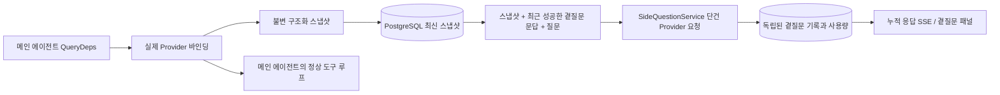

# BODA `/btw` 곁질문

한국어 · [中文](README.zh.md)

일반 채팅, 작업의 MainAgent, 그리고 현재 작업이 직접 띄운 Worker 는 본문 대화와 분리된 곁질문을 각각 지원합니다. 메인 입력창에 `/btw 질문` 을 입력하면 곁질문을 제출하고, 내용 없이 `/btw` 만 입력하거나 "곁질문" 버튼을 누르면 이전 곁질문 기록을 엽니다. 데스크톱에서는 너비를 조절할 수 있는 사이드바로, 모바일에서는 드로어(Drawer)로 표시합니다.

곁질문 응답은 질문을 제출한 시점의 에이전트 컨텍스트 스냅샷을 바탕으로 생성하며, 스트리밍 표시·추가 질문·중지·비우기를 지원합니다. 패널을 닫거나 페이지를 새로 고치거나 SSE 연결이 끊겨도 모델 요청은 취소되지 않습니다. 중지는 현재 진행 중인 곁질문 하나에만 영향을 주고, 비우기는 곁질문을 취소하면서 곁질문 기록까지 삭제하되 본문 컨텍스트 스냅샷은 그대로 남깁니다.

> 이 문서는 원본 중국어 문서(`README.zh.md`)를 한국어로 옮긴 것입니다. 상류(upstream) 저장소의 변경을 대조하기 쉽도록 원본은 그대로 보존합니다.

## 구현 범위

Go, norma v0.3.7, Next.js, 그리고 기존 Markdown · ResizablePanel · Drawer · AlertDialog 컴포넌트를 그대로 사용하며, norma 소스를 수정하거나 곁질문을 위해 새 의존성을 추가하지는 않았습니다. Planner, 다른 작업에서 이어받은 Worker, 도구형 하위 작업의 승격은 이번 범위에 들어가지 않습니다.

- `capture.go` 는 `Options.Deps.CallModel` · `CallModelSync` 에서만 메인 루프 요청으로 표시합니다. Provider 데코레이터는 개별 모델 내부, 즉 라우팅 풀이 바깥에서 모델을 고른 다음 단계에 자리 잡으므로, 실제로 선택된 모델을 기록합니다. 압축 요청과 요약 요청은 스냅샷을 덮어쓰지 않습니다.
- 요청을 시작한 시점, 모델이 응답을 완결한 시점, 실행이 종료 상태에 이른 시점에 스냅샷을 발행합니다. 생성 도중인 반쪽 응답은 발행하지 않습니다. 도구 호출은 norma 의 `MessagesForAPI` 를 거쳐 짝을 유지하고, 도구 결과는 다음 메인 모델 요청이나 실행 종료 상태에서 스냅샷에 들어갑니다. 스트리밍이 중단되면 직전의 유효한 경계를 유지합니다.
- 스냅샷은 JSON 깊은 복사로 구조화 메시지, 시스템 프롬프트, 도구 정의, 생성 파라미터를 보존합니다. 모델 추론은 스냅샷 잠금이나 데이터베이스 트랜잭션을 쥐지 않습니다.
- `SideQuestionService` 는 개별 Provider 를 호출합니다. 필요하면 먼저 곁질문 요약을 만들고, 최종 응답은 컨텍스트가 처음으로 한도를 넘고 아직 텍스트나 도구 호출을 내보내지 않은 경우에 한해 한 번만 줄여서 재시도합니다. 에이전트 세션을 새로 만들지 않고, 도구 실행기·메인 transcript·활동 스트림·작업 그래프에 연결하지 않으며, 작업 모델 전환 체인도 거치지 않습니다. 응답이 도구 정의를 유지하는 것은 기존 구조화 도구 컨텍스트와 호환하기 위해서이고, 요약 요청에는 도구를 제공하지 않습니다. 새로 반환된 도구 호출에는 실행 경로가 없습니다.
- 상위 세션마다 실행 중인 요청은 하나이고, 서비스 프로세스 하나당 최대 네 개이며, 요청 하나의 제한 시간은 120초입니다. 곁질문은 서비스 생명주기 아래에서 독립된 취소 컨텍스트를 사용합니다.
- 곁질문 요청은 모델 설정 참조와 민감하지 않은 식별 정보 요약을 보관하고, 요청하는 시점에 기존 설정에서 자격 증명을 가져옵니다. 설정이 삭제되거나 모델·프로토콜·주소 같은 식별 필드가 바뀌면, 먼저 메인 에이전트를 실행해 스냅샷을 갱신하도록 요구합니다. 테스트는 제품 기본 모델을 바꾸지 않습니다.

## 영속화와 복구

`db/schema.sql` 은 `side_question_sessions` 와 `side_question_requests` 테이블을 자동으로 만듭니다. 앞 테이블은 상위 리소스, 최신 스냅샷, 실행 번호, 버전, 정리 버전을 저장하고, 뒤 테이블은 질문, 누적 응답, 상태, 모델, 스냅샷 시각, 사용량, 이벤트 순번, 페이지 순번을 저장합니다.

상위 세션 키는 conversation ID 를 쓰거나, task ID 와 exploration ID 와 intent ID 를 묶어서 씁니다. Worker 는 재사용할 수 있는 실행 슬롯 이름을 쓰지 않습니다.

스냅샷은 상위 세션 단위로 병합해 기록하고 250밀리초마다 한 번씩 반영하며, 데이터베이스가 `(run_id, version)` 을 비교해 오래된 버전이 최신 버전을 덮어쓰지 못하게 막습니다. 곁질문을 제출하기 직전에 선택한 스냅샷을 한 번 더 저장합니다. 저장에 성공하면 메모리에 있던 큰 스냅샷을 해제하고, 실패하면 아직 기록하지 못한 버전을 남겨 둡니다. 누적 응답 내용은 스트리밍 이벤트가 도착할 때 최대 250밀리초에 한 번씩 기록하고, 종료 상태에서는 즉시 저장하되 데이터베이스 오류가 나면 제한된 횟수만큼 재시도합니다.

서비스가 시작할 때 이전에 `running` 상태로 남아 있던 요청을 `interrupted` 로 표시하고, 이미 데이터베이스에 저장된 일부 응답과 사용량은 그대로 두며, 요청을 자동으로 다시 실행하지는 않습니다. 가장 최근에 성공적으로 저장한 컨텍스트는 다음 질문에 바로 쓸 수 있습니다. 오래된 세션에 스냅샷이 없으면 먼저 메인 에이전트를 실행하도록 요구하고, UI 활동 기록에서 컨텍스트를 다시 만들어 내지는 않습니다.

비우기 작업은 정리 버전을 하나 올리고 요청을 삭제하며, 조건부 업데이트가 뒤늦게 도착한 콜백을 다시 기록하지 못하게 막습니다. 상위 리소스를 물리적으로 삭제할 때는 외래 키 캐스케이드에 맡기고, Worker 를 논리적으로 삭제할 때는 같은 트랜잭션 안에서 곁질문 데이터를 함께 삭제한 뒤 그 후 뒤늦게 도착하는 스냅샷을 거부합니다. 작업을 아카이브할 때는 먼저 새 요청을 막고, 메인 흐름이 멈추기를 기다리고, 곁질문을 취소한 뒤 데이터베이스에 반영되기를 기다립니다. 아카이브 형식은 v3 이며, 곁질문 테이블이 없는 v1 · v2 와도 호환됩니다.

기록은 빠짐없이 저장하고, 순번 커서를 기준으로 한 페이지에 최대 20건을 돌려줍니다. 모델 요청에는 가장 최근에 성공한 문답 원문을 최대 20묶음까지 다시 실어 보내되, 그 분량을 토큰 예산에 맞춰 제한하고, 그보다 오래된 문답은 별도의 롤링 요약으로 관리합니다. 본문 컨텍스트가 예산을 넘으면 곁질문 사본의 오래된 부분만 요약하고, 최근 구조화 도구 호출과 그 결과는 남겨 둡니다. 요약과 준비 진행 상황과 사용량은 모두 곁질문의 동시 실행·취소·120초 제한 시간 규칙 안에 함께 들어갑니다. 자세한 내용은 [컨텍스트 예산과 오픈소스 참고 자료(CONTEXT_BUDGET.md)](CONTEXT_BUDGET.md) 를 참고하십시오.

## HTTP 계약

다음 경로를 `{parent}` 로 쓰며, 기존 인증과 리소스 검증을 그대로 따릅니다.

- `/api/conversations/{id}`
- `/api/tasks/{id}/chat`
- `/api/tasks/{id}/intents/{iid}`

요청별 반환과 동작은 다음과 같습니다.

- `GET {parent}/side-questions?before={ordinal}` 는 `items` 를 최신순으로 정렬해 돌려주고, 진행 중인 실행 상태(`current`), 스냅샷 메타 정보(`snapshot`), 다음 커서(`next_cursor`)를 함께 반환합니다. 커서가 0 이면 최신 페이지이거나 다음 페이지가 없다는 뜻입니다.
- `POST {parent}/side-questions` 는 `{ "question": "…", "client_request_id": "UUID" }` 형태의 JSON 을 받습니다. 새 요청이면 202 와 함께 요청 객체를 돌려주고, ID 와 질문이 같으면 기존 객체를 200 으로 돌려줍니다.
- `DELETE {parent}/side-questions` 는 현재 상위 세션의 곁질문 문답을 취소하고 비웁니다.
- `GET /api/side-questions/{requestID}/events` 는 `snapshot` SSE 이벤트를 보내며, `id` 는 증가하는 순번이고 `data` 는 누적된 전체 요청 객체입니다. 비우기가 일어나면 `cleared` 를 보냅니다.
- `POST /api/side-questions/{requestID}/cancel` 는 요청을 명시적으로 취소하며, 종료 상태는 기록이나 SSE 에서 읽을 수 있습니다.

질문은 최대 4000자입니다. 스냅샷이 없거나, 모델 설정이 바뀌었거나, 같은 상위 세션이 처리 중이거나, 멱등 ID 가 충돌하면 409 를 돌려주고, 전체 동시 실행 상한에 걸리면 429 를 돌려줍니다. SSE 연결은 매번 누적 상태를 먼저 보내므로, 클라이언트가 앞서 받은 텍스트 조각에 의존하지 않습니다. 프런트엔드는 요청 ID 와 순번으로 응답을 합치고, 상위 세션을 바꾸거나 비울 때 이전 콜백을 폐기합니다.

## 검증과 참고 자료

자동화 검사, 실제 모델 사용, 알려진 제한은 [VALIDATION.md](VALIDATION.md) 에 정리했습니다.

독립 요청 방식은 [Grok CLI 의 side-question.ts(고정 커밋)](https://github.com/superagent-ai/grok-cli/blob/fb97af83f06dca873281d60168430f06c8de6324/src/utils/side-question.ts) 를, 실행 격리는 [OpenCode(고정 커밋)](https://github.com/anomalyco/opencode/tree/b3f1a96c6dd7adeb28b36dd11add1998fc84d67b) 를 참고했습니다. BODA 는 컨텍스트에 norma 의 구조화 메시지를 사용하며, 프런트엔드 로그에서 텍스트를 이어 붙이는 방식은 쓰지 않았습니다.
